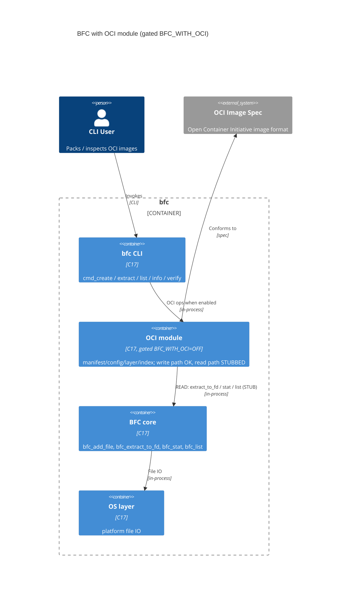

# Architecture Model: BFC OCI Integration

**Generated from:** grounded source analysis of `oci-image-specs-resolve` (PR #5)
**Format:** Mermaid C4 + CALM JSON (`bfc-oci.calm.json`)
**Toolchain:** CALM CLI not installed → Mermaid primary, CALM JSON hand-written

## Purpose

Make the OCI-module → BFC-core coupling explicit to validate the **in-tree integration boundary** before resolving conflicts and finishing the implementation. Verdict: the boundary is **thin and clean** (OCI only uses BFC public primitives), which supports keeping it in-tree **gated behind `BFC_WITH_OCI` (default OFF)**.

## C4 — Container/Component

## Coupling summary (grounded in `src/lib/bfc_oci.c`)

| OCI → core call | Count | Path | Status |
|---|---|---|---|
| `bfc_add_file` | 4 | write | implemented |
| `bfc_extract_to_fd` | 3 | read | callable, but enclosing `get_oci_*` are stubs |
| `bfc_stat` | 1 | read | implemented |
| `bfc_list` | 1 | read | implemented |

The OCI layer depends **only on BFC's public C API** — no reach-in to core internals. That is the key result: the in-tree boundary is sound, so the architectural objection from `/flow:stress` (maintainability/scope) is mitigated *provided* the module stays gated `OFF` and the read path is completed.

## Validation (against source)

| Node / edge | Status | Evidence |
|---|---|---|
| `bfc-oci` | [GROUNDED] | `src/lib/bfc_oci.c` (built via `src/lib/CMakeLists.txt`) |
| `bfc_add_file`, `bfc_extract_to_fd`, `bfc_stat`, `bfc_list` | [GROUNDED] | call sites in `bfc_oci.c` |
| OCI structs | [GROUNDED] | `include/bfc_oci.h` |
| `oci-to-core-read` (read path) | [GROUNDED-BUT-STUB] | `bfc_get_oci_manifest/config`, `bfc_list_oci_layers` = `// TODO: Implement`, `return BFC_OK` |
| `src/bfc_oci.c` | [DEAD] | identical orphan copy, not in any CMakeLists — delete |

## Architectural action items (feed conflict-resolution + fixes)

1. **Delete the orphan** `src/bfc_oci.c` (dead duplicate of `src/lib/bfc_oci.c`).
2. **Implement the read path** — `bfc_get_oci_manifest/config`, `bfc_list_oci_layers` must actually read from the container, not `return BFC_OK` blindly (correctness bug + Copilot finding).
3. **Default `BFC_WITH_OCI=OFF`** — keeps the gated boundary the model assumes.
4. **Bound `layer->digest` copies** — fixed-size buffer overflow risk (Copilot finding).
5. Drop the unnecessary `(void*)` cast on `fmemopen` (`bfc_oci.c:89`).
6. Extend (don't delete) existing examples; dynamic OS/arch detection in `oci_example.c`.
